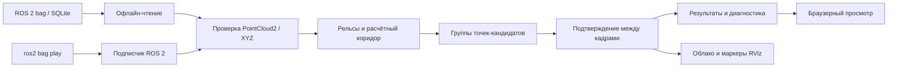

# Архитектура и алгоритм

> **Для жюри.** Один и тот же геометрический детектор обрабатывает облако точек офлайн или из ROS 2. Сначала он оценивает путь и предполагаемый габарит, затем ищет группы точек-кандидатов и подтверждает их в соседних кадрах. Обучение модели и GPU не требуются.
>
> **Проект:** [публичный код](https://github.com/kurorodev/lct2026_metro) · [веб-демонстрация](http://111.88.155.2/). [Локальный запуск](../README.md#локальный-запуск) выполняется на небольшом bag без установленного ROS 2.

Ниже — схема и инженерные детали обработки.

`metro_guard/cloud.py` проверяет payload, offsets, datatype, count, endianness и шаги строк. Не предполагает, что точка занимает 12 или 16 байт: в данных она занимает 26 байт, а timestamp float64 начинается с несоосного offset 18. Поля описаны самим PointCloud2; [официальное определение](https://docs.ros2.org/latest/api/sensor_msgs/msg/PointCloud2.html).

Офлайн и ROS используют один `Detector`. Проигрыватель не настраивает детектор по имени bag. GPU и обучение не требуются. В исходных записях нет IMU/TF/одометрии; поэтому не выполняется некорректное вычитание последовательных облаков без компенсации движения.

ROS-подписка получает raw CDR bytes, затем рабочий поток декодирует их через rosbags. Это позволяет использовать тот же декодер, что и офлайн, и не создавать ROS Python-массив из десятков мегабайт непосредственно в callback. Визуализация упаковывает contiguous float32 XYZ напрямую в PointCloud2.

## Геометрия

1. Удаляются нечисловые и полностью нулевые точки. Применяется явный поворот осей из конфигурации. ROI ограничивается впереди датчика; исходный архив не изменяется.
2. В поперечных сечениях через 5 m оценивается доминирующая низкая поверхность. Низкий квантиль задаёт область поиска, мода гистограммы помогает не принять дренажную канаву за весь пол.
3. На высотах 0.6–2.6 m над этой поверхностью оцениваются боковые конструкции. Согласованная пара стен даёт более сильную поддержку, одна сторона — слабую. Смещение центра ограничено по производной. В двухпутном тоннеле это остаётся неоднозначным.
4. В нижней части ищутся пары поперечных пиков с расстоянием около заданной колеи. Если есть не менее двух сечений с такой гипотезой, уточняется центр между рельсами и медианная поправка высоты от полотна к рельсовой поверхности. Это эвристика, не гарантированная сегментация рельсов. Нет определения маршрута на стрелке.
5. Габарит сужается у нижней части и расширяется до верхней полуширины. Точки ближе 0.2 m к оценке потолка исключаются как поверхность тоннеля. Чертёж габарита, высота монтажа, roll/pitch и отступ до носа поезда должны заменить текущие предположения.

Для высоты h полуширина задаётся `w(h) = w_low + (w_full − w_low) · clip(h / h_full, 0, 1)`. Кандидат лежит внутри боковой границы, выше `min_height`, ниже `max_height` и ниже оценённого потолка. Область не экстраполируется через большие пустые промежутки без локального сечения.

Точки объединяются по смежности вокселей 0.35 m (26 соседей). Применяются минимальное количество точек и размер. Это вычислительно доступный baseline: на большой дальности он может разбивать редкий объект на части; адаптивные к дальности радиусы требуют следующих экспериментов. Отбрасывание малых кластеров снижает шум, но может пропускать малые/дальние препятствия.

## Временная обработка

Текущие кластеры ассоциируются с предыдущими с ограничениями продольного, поперечного и вертикального перемещения. Подтверждение требует трёх последовательных совпадений. Нет предсказания скорости или объединения точек в глобальную карту. Пропуск наблюдения прекращает трек; разрыв/откат времени очищает историю. При 10 Hz само подтверждение добавляет около 0.2 s после первого наблюдения; это отдельная задержка сверх вычислений.

Скаляр `evidence_score` описывает количество точек, видимый размер и поддержку геометрии; статистически не калиброван. Подтверждение во времени не делает ошибочную сегментацию истинной: постоянный кабель может давать постоянную ложную тревогу.

## Отказоустойчивость и границы

В ROS очередь обработки ограничена двумя ожидающими кадрами (параметр `queue_depth`); при переполнении удаляется старейший и увеличивается счётчик. Небольшая очередь сглаживает приход DDS-сообщений пачками, но добавляет ожидание, которое входит в `callback_to_result_ms`. Watchdog по монотонным локальным часам переводит выход в `unknown` при пропаже потока. Ошибки декодирования публикуют диагностику. Вход имеет SensorData QoS; совместимость QoS влияет на доставку и требует проверки на стенде. [ROS 2 QoS](https://docs.ros.org/en/humble/Concepts/Intermediate/About-Quality-of-Service-Settings.html).

Никакая команда торможения не публикуется. Нет утверждений о сертификации, гарантированной безопасности, обнаружении любого объекта или работе на 300 m. `geometry_range_m` — координата последнего оценённого сечения, не гарантированная дальность обзора. Препятствие за пределами покрытой геометрии, за поворотом или без отражённых точек алгоритм может не увидеть.

## Приоритет дальнейшего улучшения

В версии 0.2 добавлен альтернативный `geometry_model=rail_guided` (`metro_guard/geometry.py`). Он выделяет пики рельсов над поперечным фоном, проверяет согласованность их высоты и оценивает реальные боковые отступы, а не предполагает одинаковое сечение для стены и платформы. Проверки включают асимметричное расположение стен и объект у границы габарита. Исходный алгоритм сохранён в `baseline_geometry.py` для воспроизводимого сравнения и остаётся по умолчанию: изменение числа тревог не заменяет измерения precision/recall.

При `boundary_margin > 0` кластер остаётся в выходе, даже если нет достаточного числа точек глубже этой границы. Он получает `boundary_uncertain=true`, а `temporally_confirmed` и `confirmed` различаются. Это явная неопределённость положения габарита, не доказательство отсутствия препятствия. Оценщик считает такой неподтверждённый кадр пропуском при положительной эталонной метке.

Сначала независимая разметка и калибровка, затем устойчивое извлечение текущей пары рельсов и точного габарита. Для дальности — анализ плотности отражений по размеру объекта, адаптивная кластеризация, оценка LiDAR-одометрии с контролем вырожденности тоннеля. После этого сравнивать с обучаемой моделью нормального тоннеля. Не добавлять нейросеть только ради использования GPU.
