# Руководство по проекту Metro Guard

> **Для жюри.** Metro Guard превращает запись LiDAR в список возможных препятствий и средство для просмотра кадров. Прототип включает офлайн-обработку, браузерную разметку и интеграционный узел ROS 2. Известные результаты и их ограничения сначала описаны в [главном README](../README.md).
>
> **Проект:** [публичный код](https://github.com/kurorodev/lct2026_metro) · [веб-демонстрация](http://111.88.155.2/). Начать локально можно по [короткой инструкции](../README.md#локальный-запуск).

Ниже — подробный технический справочник по входным данным, конфигурации и компонентам.

Это основная техническая документация репозитория. Она описывает назначение и статус программы, состав каталогов, входные данные, алгоритм, конфигурации, оба способа запуска, формат результатов и проверку качества.

## 1. Назначение и текущий статус

Программа обрабатывает трёхмерные облака точек LiDAR и ищет кластеры, которые могут пересекать предполагаемый габарит движения поезда. Один алгоритмический модуль используется офлайн и в ROS 2.

Текущая версия — **исследовательский прототип** на Python и NumPy. Он выполняет геометрический поиск и временное подтверждение, экспортирует результаты в JSON и предоставляет браузерный просмотрщик. Модель машинного обучения и CUDA не используются.

На новом бэге устранён пропуск низкого предмета высотой около 0,2 м. При этом часть внешних объектов по-прежнему вызывает тревоги: точный контур поезда не задан. Нет независимой покадровой разметки всех исходных проездов, поэтому текущие прогоны не подтверждают заявленную полноту или точность на скрытых данных. Прототип **не подключён к управлению тормозами и не является защитным устройством**.

## 2. Каталоги и точки входа

| Путь | Роль |
|---|---|
| `metro_guard/cloud.py` | Проверяет `PointCloud2` и приводит XYZ к единой системе осей |
| `metro_guard/bag.py` | Читает ROS 2 bag через библиотеку `rosbags` |
| `metro_guard/surface.py` | Оценивает дорожное полотно и проверяет гипотезу пары рельсов |
| `metro_guard/baseline_geometry.py` | Базовая оценка центра пути по боковым конструкциям |
| `metro_guard/geometry.py` | Экспериментальная геометрия по рельсам и местной ширине тоннеля |
| `metro_guard/detector.py` | ROI, габарит, кластеризация, треки, статусы и диагностика |
| `metro_guard/config.py` | Загрузка и валидация JSON-конфигурации |
| `metro_guard/output.py` | Блокировка параллельных запусков и публикация полного результата |
| `metro_guard/cli.py` | Офлайн-команда `run`, локальный просмотрщик `serve` и запуск оценщика |
| `metro_guard/ros_node.py` | ROS 2 адаптер: подписка на облако и публикация результата/маркеров |
| `metro_guard/evaluate.py` | Расчёт метрик по независимо созданным меткам JSONL |
| `metro_guard/web/` | Локальный HTML/JavaScript просмотрщик и форма ручной разметки |
| `config/` | Готовые профили детектора и XML для Fast DDS |
| `tests/` | Модульные проверки ядра и экспорта |
| `scripts/` | Аудит bag, сравнение запусков и проверки Docker/ROS/HTTP |
| `docs/` | Этот документ и подробные специализированные отчёты |
| `data/` | Локальные входные bag; содержимое данных не включается в образ |
| `outputs/` | Локальные результаты и экспорт предпросмотра |

Две среды выполнения используют один пакет:

| Образ | Назначение | База |
|---|---|---|
| `Dockerfile` | ROS 2 Humble, узел, playback, RViz2 и ROS smoke-тест | ROS Humble / Ubuntu 22.04 |
| `Dockerfile.server` | Офлайн-обработка bag и Nginx-просмотр результатов | Python 3.11 slim |

На малом сервере основной путь — облегчённый профиль Compose. ROS-вариант нужен для интеграции с ROS-узлом или RViz; установливать ROS 2 на хост для офлайн-чтения bag не требуется.

## 3. Входные данные и координаты

### ROS 2 bag

Ожидается каталог ROS 2 bag с `metadata.yaml` и SQLite storage `.db3`. Во входном соединении должен присутствовать топик типа `sensor_msgs/msg/PointCloud2`. Если найдено несколько подходящих топиков, их нужно выбрать через `--topic`.

`cloud.py` читает описания полей сообщения: типы и смещения, размер точки и строки, число строк и порядок байтов. Поэтому декодер не предполагает, что сообщение всегда является плотно упакованным XYZ. Точки с NaN/Inf и полностью нулевые XYZ исключаются при обработке.

Например, предоставленные архивы содержат `x/y/z/intensity`, `ring` и `timestamp`; одна точка занимает 26 байт. Офлайн-режиму требуются только XYZ. ROS-вход напрямую зависит от корректной сериализации PointCloud2 и согласованных QoS.

### Канонические оси

Детектор переводит координаты в правую систему:

- **X** — вперёд по ходу;
- **Y** — влево;
- **Z** — вверх.

В архиве направление вперёд предварительно определено как исходное `-Y`, поэтому в текущих JSON используется `"forward_axis": "-y"`. Это наблюдение по геометрии облаков, а не полная калибровка поворота относительно поезда. Сдвиг, roll/pitch, положение относительно передней части состава и точная форма габарита из него не следуют.

На новом бэге сообщено, что LiDAR находится на высоте **1,075 м над головкой рельса и по центру состава**. `lidar_height` в профиле `mounted_lidar.json` использует высоту как начальную вертикальную опору для rail-guided оценки. Далее положение рельсов оценивается по облаку. Эта настройка не является полной шестимерной трансформацией LiDAR → поезд.

### Временные метки

Bag timestamp и header timestamp сохраняются отдельно, так как они могут относиться к разным часам. В офлайн-детекторе для последовательной ассоциации применяется header timestamp, если он положительный; иначе используется время bag. Не вычитайте эпоху header из текущих системных часов для оценки задержки датчика.

## 4. Как устроен алгоритм

```mermaid
flowchart LR
    A[ROS 2 bag или PointCloud2] --> B[Проверка полей и извлечение XYZ]
    B --> C[Канонические оси и ROI]
    C --> D[Оценка полотна, пути и потолка]
    D --> E[Предполагаемый габарит]
    E --> F[Воксельные кластеры]
    F --> G[Сопоставление с прошлыми кадрами]
    G --> H[Статус и диагностика]
    H --> I[JSON, просмотрщик или ROS topics]
```



В каждом кадре программа:

1. Проверяет форму массива, фильтрует нечисловые/нулевые точки и поворачивает оси по `forward_axis`.
2. Ограничивает поиск параметрами дальности и поперечным/вертикальным ROI.
3. Делит данные на продольные сечения шириной `bin_size` (по умолчанию 5 м). Оценивает низкую поверхность по распределению высот, а не по одному нижнему отражению.
4. Оценивает центр пути и боковые конструкции. В `baseline` применяется гипотеза номинального отступа от стен. В `rail_guided` ищется пара пиков с близкой к `rail_gauge` колеёй и используются локальные наблюдения боковых конструкций.
5. Интерполирует центр, поверхность и полуширину предполагаемого габарита в доступных сечениях. Порог высоты отсчитывается от оценённой поверхности; точки у оценённого потолка исключаются.
6. Соединяет оставшиеся точки в компоненты по смежности 0,35-метровых вокселей и отбрасывает малые компоненты по числу точек и размеру.
7. Сопоставляет кластеры с предыдущими наблюдениями по расстояниям и поддерживает их ID/hits. По умолчанию нужны три последовательных совпадения.
8. Выдаёт ближайшую подтверждённую дистанцию, кандидатов, поддержку геометрии, причины деградации и время обработки.

Это причинный геометрический baseline: он не вычитает соседние облака, не использует глобальную карту и не компенсирует движение по IMU/одометрии. Сам факт повторного обнаружения объекта во времени не гарантирует, что объект посторонний: кабели и элементы инфраструктуры могут давать постоянные ложные тревоги.

## 5. Конфигурации

| Файл | Модель и смысл |
|---|---|
| [`config/default.json`](../config/default.json) | Базовый профиль; остаётся настройкой по умолчанию для сравнения |
| [`config/rail_guided.json`](../config/rail_guided.json) | Экспериментальная оценка геометрии по рельсам с непустой пограничной зоной |
| [`config/mounted_lidar.json`](../config/mounted_lidar.json) | Rail-guided с начальной опорой высоты 1,075 м и сниженным порогом для низких объектов |

Перед запуском можно посмотреть эффективный JSON. Основные параметры:

| Поле | Текущая роль |
|---|---|
| `geometry_model` | `baseline` или `rail_guided` |
| `forward_axis` | Направление движения в исходных координатах: `x`, `-x`, `y`, `-y` |
| `min_range`, `max_range` | Продольная область поиска; верхний предел не является гарантированной дальностью обнаружения |
| `half_width`, `underbody_half_width`, `full_width_height` | Модель сужения предполагаемого габарита снизу и расширения выше |
| `min_height`, `max_height` | Высотная полоса поиска над оценённой поверхностью |
| `boundary_margin` | Неопределённая зона у бокового края; геометрически пограничный кандидат может не подтверждаться |
| `lidar_height` | Необязательная начальная вертикальная опора для `rail_guided`; без коррекции roll/pitch |
| `rail_gauge`, `rail_gauge_tolerance` | Интервал гипотезы колеи для rail-guided модели |
| `bin_size`, `min_ground_points` | Продольное сечение и минимальная опора для геометрии |
| `min_cluster_points`, `min_cluster_extent` | Отсев малых кластеров |
| `confirm_frames`, `max_frame_gap` | Временное подтверждение и сброс истории при разрыве |
| `max_relative_speed` | Допуск смещения при ассоциации; не оценка скорости поезда |

Все расстояния и ширины заданы в метрах. Валидатор отклоняет неизвестную геометрическую модель, некорректные оси, нечисловые пороги и несовместимое применение `lidar_height` к baseline.

**Контур состава не подтверждён чертежом.** В профилях остаются предположения о ширине и высоте. Изменение ширины специально под внешний объект на одном бэге может скрыть ложную тревогу на этой записи и создать пропуск на другой; такой подбор не является калибровкой.

## 6. Запуск офлайн-обработки

Установите окружение по командам из [README](../README.md). Затем:

```bash
python -m metro_guard.cli run PATH/TO/BAG \
  --config config/default.json \
  --topic /lidar_points \
  --output outputs/my-run \
  --export-every 10 --preview-points 2000
```

`--topic` нужен только если в bag несколько PointCloud2 топиков. Параметры предпросмотра меняют плотность браузерного экспорта, **но не вход детектора**. Для каждой записи выбирайте отдельный `--output`. `--overwrite` нужен лишь если намеренно хотите повторить запуск в уже существующий каталог.

Запуск `outputs` защищён от параллельной записи в тот же каталог. Файлы сначала готовятся во временной папке, а публикуются после завершения bag; `summary.json` записывается последним. Если чтение или обработка завершились ошибкой, неполный запуск не объявляется готовым, а старый успешный результат при `--overwrite` сохраняется.

Для исследования JSON-тел CLI видны через `python -m metro_guard.cli --help` и `python -m metro_guard.cli run --help`. Результаты не содержат ground truth и сами по себе не являются метрикой качества.

## 7. Форматы результатов

Успешный прогон сохраняет в каталоге запуска:

| Файл | Содержимое |
|---|---|
| `detections.jsonl` | Одна диагностическая JSON-запись на каждый кадр |
| `summary.json` | Число кадров, эффективный конфиг и его SHA256, статусы, задержки и пик RSS |
| `frames.json` | Прореженная визуализация: точки, коридор и кластеры |
| `index.html`, `review.js` | Локальный браузерный интерфейс без внешних CDN |
| `.metro_guard.lock` | Файл системной блокировки записи; оставляется намеренно |

Значения статуса:

| Значение | Значение для оператора |
|---|---|
| `obstacle` | Найден хотя бы один кластер, подтверждённый по времени и условиям геометрии |
| `candidate` | Кластер есть, но он ещё не подтверждён |
| `unknown` | Недостаточно надёжной геометрии или входных данных |
| `no_obstacle_observed` | В доступной оценке коридора кандидат не найден |

`no_obstacle_observed` **не означает**, что путь проверен и свободен. `degraded` и `reasons` показывают ограничения конкретного кадра, которые могут сопровождать любой статус. `distance_m` — ближайшая продольная координата X подтверждённого видимого кластера относительно LiDAR. Это не расстояние от бампера и не дистанция вдоль кривой пути. `evidence_score` — эвристический показатель, не вероятность.

## 8. Браузерный просмотр и разметка

### Локально

```bash
python -m metro_guard.cli serve outputs/my-run
```

По умолчанию сервер привязан к localhost на порту 8080. Это режим разработки, а не production-веб-сервер. Для настоящего сервера используйте Compose/Nginx из [`docs/DEPLOYMENT.md`](DEPLOYMENT.md): там есть проверка готовности, ограничения ресурсов и инструкции для корневого URL `http://SERVER_IP/`.

### Ручная разметка

1. Выберите кадр и нажмите «Скрыть результат алгоритма» для независимого просмотра.
2. Поставьте одну из меток: объект есть, нет видимого объекта или не определено.
3. При известной дальности добавьте её и выгрузите метки кнопкой JSONL.

Метки хранятся в `localStorage` браузера и не отправляются серверу. Сохраняйте скачанный JSONL отдельно от предсказаний. Оценщик проверяет соответствие кадров, timestamp и, если имеется, имя bag.

## 9. ROS 2 узел и RViz

Соберите ROS-образ:

```bash
docker build -t metro-guard:ros .
```

Для bag `doubleT_obstacle` используется топик `/sensing/lidar/hesai128/pointcloud`:

```bash
docker run --rm -it --shm-size=1g --name metro-demo \
  -v "$PWD/data/for_hackathon:/data:ro" \
  metro-guard:ros demo /data/doubleT_obstacle /sensing/lidar/hesai128/pointcloud
```

Для других записей базового набора используется `/lidar_points`:

```bash
docker run --rm -it --shm-size=1g --name metro-demo \
  -v "$PWD/data/for_hackathon:/data:ro" \
  metro-guard:ros demo /data/roundT_doubleT
```

В другой консоли можно наблюдать JSON результата:

```bash
docker exec metro-demo bash -lc \
  'source /opt/ros/humble/setup.bash && ros2 topic echo /metro_guard/result'
```

Узел подписывается с SensorData QoS, получает raw CDR и декодирует облако в рабочем потоке. Основные выходы:

| Топик | Тип | Содержимое |
|---|---|---|
| `/metro_guard/result` | `std_msgs/String` | JSON-результат, статус, причины и счётчики |
| `/metro_guard/cloud` | `sensor_msgs/PointCloud2` | До 20 000 точек для визуализации |
| `/metro_guard/markers` | `visualization_msgs/MarkerArray` | Коридор и боксы кандидатов |

RViz Fixed Frame — виртуальный `metro_guard_lidar` (вперёд/влево/вверх). Он не является калиброванным `base_link`. Очередь ROS ограничена; при переполнении выбрасывается самое старое ожидающее сообщение. Watchdog публикует `unknown` при отсутствии свежего входа. Для больших сообщений в Docker передавайте `--shm-size=1g` и сохраняйте конфигурацию Fast DDS из `config/fastdds.xml`.

Живой LiDAR на целевом стенде требует отдельной проверки DDS discovery, сетевого маршрута, QoS, времени и задержек. Успешное воспроизведение bag не заменяет эту проверку.

## 10. Измерение качества

Оценщик принимает `detections.jsonl` и самостоятельно подготовленный файл меток. Минимальная строка меток:

```json
{"frame_index":0,"obstacle_present":true,"nearest_distance_m":24.8,"bag_name":"example_bag","bag_timestamp":946685786.9}
```

`obstacle_present` — только `true`, `false` или `null` для непроверенного кадра. Создавайте метки, не просматривая прогнозы, когда цель — независимая оценка. Отсутствие проверенной разметки не считается отрицательным примером.

```bash
python -m metro_guard.evaluate \
  outputs/my-run/detections.jsonl labels/reviewed.jsonl \
  --output outputs/metrics.json
```

Оценщик считает покадровые TP/FP/TN/FN, precision, recall, частоту ложноположительных **кадров** и условную MAE дальности. `unknown`/`candidate` без подтверждения считаются пропуском при положительной метке. Метрики объектных событий и ложных тревог в час не вычисляются без отдельной разметки событий и времени наблюдения.

Без разметки независимых кадров нельзя выводить accuracy, recall, precision или гарантированную дальность из списка детекций и названий bag.

## 11. Проверки, аудит и сравнение

Быстрый набор тестов:

```bash
python -m unittest discover -s tests -v
```

Тесты покрывают чтение облаков с разными layout/endianness, поворот осей, синтетический тоннель, низкое препятствие, подтверждение и сброс трека, оценщик с метками и безопасную публикацию файлов.

В CI отдельно запускаются ядро, Docker ROS smoke-test и Compose-серверная проверка. Локальную серверную проверку запускайте так:

```bash
./scripts/server.sh build
bash scripts/server_smoke.sh
```

Создаётся небольшой синтетический bag без личных данных; проверяются препятствие, HTTP, готовность после перезапуска Nginx, скрытие неполного результата и доступность только разрешённых файлов.

Чтобы сравнить геометрию на всех шести старых записях, нужны распакованные bag и дополнительное место:

```bash
python scripts/benchmark_all.py \
  --data data/for_hackathon \
  --config config/default.json \
  --output outputs/baseline

python scripts/benchmark_all.py \
  --data data/for_hackathon \
  --config config/rail_guided.json \
  --output outputs/rail-guided
```

Аудит исходных bag и 2D-проекций требует Pillow:

```bash
python -m pip install -r requirements-analysis.txt
python scripts/audit_data.py --data data/for_hackathon --output analysis
```

Сводка содержимого исходного набора — [ANALYSIS.md](ANALYSIS.md); сравнение алгоритмов — [EXPERIMENTS.md](EXPERIMENTS.md).

## 12. Известные ограничения

- Нет утверждённого контура габарита поезда, калибровки ориентации и полной трансформации LiDAR относительно состава.
- Пара боковых конструкций и рельсы задают эвристическую геометрию. Два пути, платформы, стрелки, стены и кабели могут приводить к смещению пути или тревоге.
- Редкие и дальние точки могут быть отброшены или распасться на малые кластеры; фиксированный размер вокселя — компромисс.
- Временное подтверждение занимает несколько кадров и не предотвращает устойчивые ложные срабатывания.
- Нет независимой разметки всех предоставленных записей. На десяти контрольных объектах нового bag отмечены ошибки по внешним объектам; см. [отчёт](FAKE_SCENARIO_RESULTS.md).
- Не гарантируются обнаружение объекта любого размера, любая дальность, обработка скрытых сценариев, работа в реальном времени на любой машине или безопасное управление поездом.
- Статический просмотрщик публикует заранее сформированные результаты. Он не загружает bag через браузер и не является системой пользователей/хранения разметки на сервере.

## 13. Связанная документация

- [Деплой Ubuntu 24.04, 2 ГБ RAM, 20 ГБ диска](DEPLOYMENT.md).
- [Архитектура и алгоритм](ARCHITECTURE.md).
- [Разбор ТЗ и аудит данных](ANALYSIS.md).
- [История экспериментов](EXPERIMENTS.md).
- [Новый bag и параметры установки LiDAR](NEW_DATA.md).
- [Покадровая проверка десяти новых объектов](FAKE_SCENARIO_RESULTS.md).
